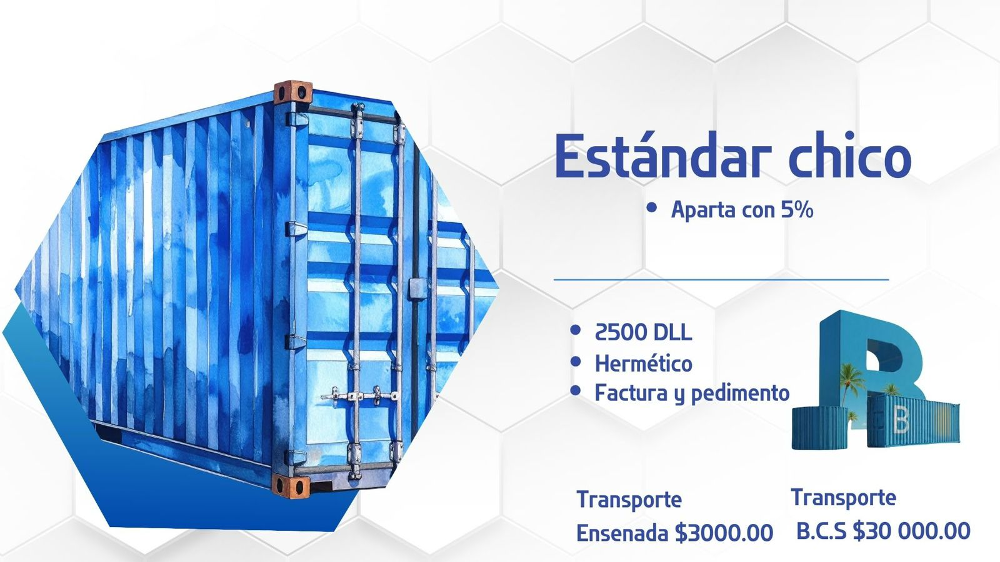

# 📦 Project Brief — Contenedores B Landing Page

## Resumen del Proyecto

Landing page estática para **Contenedores B**, empresa de venta de contenedores marítimos con cobertura en Baja California (Ensenada) y Baja California Sur. El sitio debe ser visualmente impactante, fácil de navegar y diseñado con arquitectura que facilite la futura integración a un CMS (WordPress o Sanity).

---

## Información del Cliente

| Campo            | Detalle                            |
|------------------|------------------------------------|
| **Empresa**      | Contenedores B                     |
| **Industria**    | Venta de contenedores marítimos    |
| **Cobertura**    | Ensenada B.C. / Baja California Sur |
| **Referencia**   | https://contenedoresmas.com/valle-de-guadalupe |

### Equipo de ventas

| Nombre                 | Rol               | Teléfono       |
|------------------------|-------------------|----------------|
| Katia Pacheco          | Líder de Ventas   | 646 198 0991   |
| Diego Gerardo Rocha    | Líder de Ventas   | 615 103 8595   |
| Edson Ahumada          | Líder de Ventas   | 612 1516545    |

---

## Catálogo de Productos

### Estándar Chico (CH) — 20 pies
- **Precio:** $2,500 USD
- **Dimensiones:** 6m largo × 2.4m ancho × 2.5m alto
- **Características:** Hermético · Factura y pedimento
- **Apartado:** 5% del precio total

### Estándar Grande (GD) — 40 pies
- **Precio:** $3,300 USD
- **Dimensiones:** 12m largo × 2.4m ancho × 2.6m alto
- **Características:** Hermético · Factura y pedimento
- **Apartado:** 5% del precio total

### 40 HC (High Cube)
- **Precio:** $3,600 USD
- **Dimensiones:** 12m largo × 2.4m ancho × 2.9m alto
- **Características:** Hermético · Factura y pedimento
- **Apartado:** 5% del precio total

### Costos de Transporte
| Destino   | Costo          |
|-----------|----------------|
| Ensenada  | $3,000 MXN     |
| B.C.S.    | $30,000 MXN    |

---

## Identidad Visual

- **Paleta de color principal:** Azul acero (`#2B7EC4`), Azul marino oscuro (`#1B3A5C`), Blanco (`#FFFFFF`), Gris claro (`#F4F6F8`)
- **Logo:** Isotipo 3D con letras "B" y contenedor — proporcionado como imagen PNG
- **Estilo:** Industrial / moderno — limpio, profesional, confiable
- **Inspiración visual:** Hexágonos de fondo (como en los flyers del cliente), tipografía bold, fotografía de contenedores de estilo acuarela/render

### Assets disponibles (imágenes proporcionadas)
```
/assets/images/
  logo-white.jpeg          → Logo para fondo oscuro (imagen 1)
  logo-color.jpeg          → Logo para fondo claro (imagen 1)
  hero-card.jpeg           → Tarjeta presentación equipo (imagen 2)
  product-estandar-ch.jpeg → Flyer Estándar Chico
  product-estandar-gd.jpeg → Flyer Estándar Grande
  product-40hc.jpeg        → Flyer 40 HC
  tipos-contenedores.jpeg  → Diagrama de tipos y medidas
  team-katia.jpeg          → Tarjeta Katia Pacheco
  team-diego.jpeg          → Tarjeta Diego Gerardo Rocha
  team-edson.jpeg          → Tarjeta Edson Ahumada
```

---

## Arquitectura del Sitio

### Secciones (Single Page / Scroll)

```
1. HERO          → Headline impactante + CTA principal (llamar / WhatsApp)
2. NOSOTROS      → Propuesta de valor + puntos diferenciadores
3. PRODUCTOS     → Cards de los 3 modelos con precio, medidas y CTA
4. MEDIDAS       → Comparativa visual de dimensiones (tabla o diagrama)
5. TRANSPORTE    → Cobertura y precios de entrega
6. EQUIPO        → Cards del equipo de ventas con teléfono y WhatsApp
7. CONTACTO      → Formulario simple (nombre, tel, mensaje) + mapa/ubicación
8. FOOTER        → Logo, links, redes sociales, créditos
```

### Navegación (sticky header)
```
Inicio | Productos | Medidas | Contacto
```

---

## Especificaciones Técnicas

### Stack — Fase 1 (Estático)
```
HTML5 semántico
CSS3 (custom properties, grid, flexbox)
Vanilla JS (mínimo — interacciones básicas: menú móvil, smooth scroll, accordions)
Sin frameworks de JS pesados en esta fase
```

### Estructura de carpetas recomendada
```
contenedores-b/
├── index.html
├── assets/
│   ├── css/
│   │   ├── main.css
│   │   └── variables.css
│   ├── js/
│   │   └── main.js
│   └── images/
│       ├── logo/
│       ├── products/
│       └── team/
├── README.md
└── BRIEF.md
```

### Preparación para CMS (Fase 2)
Para facilitar la migración futura a WordPress o Sanity, seguir estas convenciones desde el inicio:

**Separación de datos y presentación:**
- Definir un objeto JS `siteData` en `/assets/js/data.js` con todo el contenido editable (textos, precios, equipo, productos). Así el contenido puede ser reemplazado por una API/CMS sin tocar el HTML.

```js
// assets/js/data.js
const siteData = {
  products: [
    {
      id: "estandar-chico",
      name: "Estándar Chico",
      subtitle: "20 pies",
      price: 2500,
      currency: "USD",
      dimensions: { length: "6m", width: "2.4m", height: "2.5m" },
      features: ["Hermético", "Factura y pedimento"],
      deposit: 5,
    },
    // ...
  ],
  team: [...],
  transport: [...],
};
```

**Clases semánticas para WordPress:**
- Usar clases tipo `.section-products`, `.card-product`, `.team-member` que mapeen fácil a bloques de Gutenberg o componentes de Sanity.

**Para Sanity (headless):**
- Definir schemas de contenido desde ahora: `product`, `teamMember`, `transportZone`.
- El HTML/CSS puede convertirse a React/Next.js en Fase 2 con mínimo rediseño.

---

## Requerimientos de UX/UI

- **Responsive:** Mobile-first. Breakpoints en 480px, 768px, 1024px, 1280px.
- **Performance:** Imágenes optimizadas (WebP donde sea posible), lazy loading.
- **Accesibilidad:** `alt` en imágenes, contraste WCAG AA, navegación por teclado.
- **CTAs:** Botones de WhatsApp con links `https://wa.me/52XXXXXXXXXX` y llamada `tel:`.
- **Formulario de contacto:** Puede usar Formspree o Netlify Forms en Fase 1.

---

## CTAs Principales

```
Primario:   "Cotiza ahora"     → Scroll a #contacto o WhatsApp
Secundario: "Ver productos"    → Scroll a #productos
Flotante:   Botón WhatsApp     → wa.me link fijo en mobile
```

### Links de WhatsApp
```
Katia:  https://wa.me/526461980991
Diego:  https://wa.me/526151038595
Edson:  https://wa.me/526121516545
```

---

## Copy / Textos Sugeridos

### Hero
> **Headline:** "Contenedores marítimos con entrega a toda Baja California"
> **Subheadline:** "Aparta el tuyo con solo el 5% — Hermético, con factura y pedimento."
> **CTA:** "Cotiza hoy"

### Nosotros
> Somos líderes en la venta de contenedores marítimos en Baja California. Contamos con inventario disponible, entrega a domicilio y completa formalidad en cada operación.
>
> ✔ Aparta con solo el 5%
> ✔ Hermético y certificado
> ✔ Factura y pedimento incluidos
> ✔ Entrega en Ensenada y B.C.S.

---

## Fase 2 — Roadmap futuro

| Fase | Descripción                              | CMS sugerido     |
|------|------------------------------------------|------------------|
| 2a   | Blog / artículos de usos de contenedores | Sanity o WP      |
| 2b   | Galería de proyectos realizados          | Sanity            |
| 2c   | Calculadora de costos / cotizador online | Custom (JS)       |
| 2d   | Panel de administración de inventario    | Sanity            |

---

## Decisiones Confirmadas por el Cliente ✅

| Tema | Decisión |
|------|----------|
| **Precios** | Mostrar en USD en el sitio |
| **Fotografía** | Usar estilo acuarela de los flyers mientras llegan fotos reales |
| **Imágenes futuras** | Estructura lista para swap fácil de acuarela → foto real (misma clase CSS, mismo slot) |
| **Redes sociales** | Agregar iconos con `href="#"` como placeholder — reemplazar cuando el cliente mande los links |

### Placeholders de redes sociales
```html
<!-- Reemplazar href="#" con la URL real cuando el cliente la proporcione -->
<a href="#" class="social-link" data-network="facebook" aria-label="Facebook">...</a>
<a href="#" class="social-link" data-network="instagram" aria-label="Instagram">...</a>
<a href="#" class="social-link" data-network="whatsapp" aria-label="WhatsApp">...</a>
```

### Swap de imágenes (acuarela → foto real)
Todas las imágenes de producto deben usar una clase y un `data-product` attribute para facilitar el reemplazo:
```html

```

---

## Entregables Esperados

- [ ] `index.html` — Landing page completa y funcional
- [ ] `assets/css/` — Estilos organizados con variables CSS
- [ ] `assets/js/data.js` — Datos estructurados del negocio
- [ ] `assets/js/main.js` — Interacciones (menú, scroll, etc.)
- [ ] `README.md` — Instrucciones de instalación y despliegue

---

## Notas para Claude Code

1. Iniciar con `npx create-vite@latest contenedores-b --template vanilla` o simplemente HTML plano si se prefiere cero dependencias en Fase 1.
2. Usar Google Fonts: **Barlow Condensed** para headings (industrial, bold) + **Inter** como excepción aceptada aquí por legibilidad en body, o explorar **DM Sans**.
3. El fondo hexagonal del cliente es una seña de identidad — recrearlo con CSS o SVG como patrón sutil.
4. Incluir animaciones de entrada suaves (intersection observer + CSS transitions).
5. Los flyers del cliente tienen mucha información — sintetizar y NO copiar literalmente, crear versiones web limpias de cada producto.
6. Colores CSS:
```css
:root {
  --color-primary: #2B7EC4;
  --color-primary-dark: #1B3A5C;
  --color-accent: #5BB8F5;
  --color-bg: #FFFFFF;
  --color-bg-alt: #F4F6F8;
  --color-text: #1A1A2E;
  --color-text-muted: #6B7280;
}
```

---

*Brief generado el 18 de marzo de 2026.*
*Cliente: Contenedores B | Proyecto: Landing Page v1.0*
